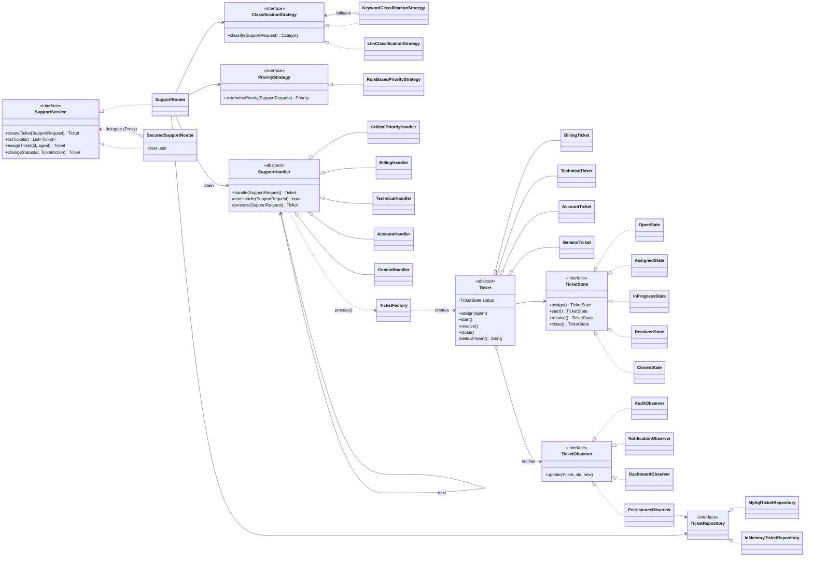

# Customer Support Router

A Java 17 project that routes customer support requests to specialized ticket
types, with role-based access control and two interfaces: a web app and an
interactive terminal. It showcases several design patterns working together:

| Pattern | Where | What it does |
|---|---|---|
| **Strategy** | `ClassificationStrategy`, `PriorityStrategy` | Swappable rules for category and priority. Keyword matching falls back to a local LLM strategy when it can't decide. |
| **Chain of Responsibility** | `handler/` | `CriticalPriorityHandler` escalates critical tickets first; otherwise the request passes along to the handler for its category. |
| **Template Method** | `SupportHandler.handle()` | Fixed "can I handle it? process it : pass it on" algorithm; subclasses only fill in `canHandle()` and optionally `process()`. |
| **Factory** | `TicketFactory` | Creates the right ticket subclass; each subclass supplies its own support team. |
| **State** | `state/` | Controls the ticket lifecycle and rejects invalid transitions. |
| **Observer** | `observer/` | Audit, notification, dashboard, and persistence observers react to every status change. Observers are injected into `SupportRouter`. |
| **Repository** | `repository/` | Hides whether tickets and users live in MySQL or in memory. |
| **Proxy** | `SecuredSupportRouter` | Same interface as `SupportRouter`, but checks the user's role before every call. |
| **MVC** (web) | `web/`, `resources/public/` | `TicketController` handles HTTP, the service layer is the model, the HTML/JS pages are the view. |

## Class Diagram



## How a Request Is Classified

1. **Keywords:** `KeywordClassificationStrategy` counts whole-word keyword matches
   for each category. A single clear winner is used directly.
2. **LLM fallback:** if no keyword matches, or two categories tie (for example
   "payment page shows an error"), the request goes to
   `LlmClassificationStrategy`. It asks a small open-source model running
   locally in [Ollama](https://ollama.com) to choose a category.
3. **Safe default:** if Ollama isn't running or returns an error, the request is
   classified as GENERAL, so routing never fails.

Priority comes from `RuleBasedPriorityStrategy`. CRITICAL requests are
escalated to the Escalation Team by the first handler in the chain.

## Roles

| Role | Can do |
|---|---|
| **Customer** | Create tickets for themselves, view their own tickets |
| **Agent** | View tickets assigned to them, start and resolve those tickets |
| **Supervisor** | View all tickets, create tickets for any customer, assign tickets to agents, start, resolve, and close |

Login is by username only (simulated login, no passwords). The demo users are:

| Username | Role |
|---|---|
| `priya`, `arjun` | Customer |
| `ravi`, `meena` | Agent |
| `sanjay` | Supervisor |

Both interfaces go through the same `SecuredSupportRouter`, so the rules are
enforced in one place. Hiding buttons or menu options is only a convenience.

## Requirements

- Java Development Kit (JDK) 17 or later
- Apache Maven 3.8 or later
- MySQL 8.0.16 or later (not needed for in-memory mode)

Maven downloads the Java dependencies automatically: MySQL Connector/J,
dotenv-java, Javalin (web server), Jackson (JSON), SLF4J Simple (logging), and
JUnit Jupiter (tests).

## Getting Started

```bash
git clone https://github.com/Nandhagopal2912/CSR.git
cd CSR/customer-support-router
```

### Configure the database

Create the database:

```sql
CREATE DATABASE customer_support;
```

- **New database:** run `src/main/resources/schema.sql` against it. This
  creates the tables and the demo users.
- **Database from an earlier version of this project:** run
  `src/main/resources/migration.sql` instead. It adds the `users` table and the
  `assigned_agent` column, and keeps your existing tickets.

Copy the configuration template and edit the local values:

```bash
copy .env.example .env
```

```env
DB_URL=jdbc:mysql://localhost:3306/customer_support
DB_USER=root
DB_PASSWORD=your_mysql_password
```

`.env` is ignored by Git. Never commit passwords or other credentials.

### Set up the LLM fallback (optional)

1. Install Ollama from https://ollama.com/download.
2. Download the small model, about 400 MB:

   ```bash
   ollama pull qwen2.5:0.5b
   ```

Ollama runs in the background on `http://localhost:11434`. To use a different
model or URL, or to turn the LLM off, set these in `.env`:

```env
LLM_ENABLED=true
OLLAMA_URL=http://localhost:11434
OLLAMA_MODEL=qwen2.5:0.5b
```

You can also add `--no-llm` to the run command to turn it off for one run.
Without Ollama the app still works, and unclear requests are classified as
GENERAL.

Both interfaces check the database connection at startup and exit with a clear
message if MySQL isn't reachable.

## Run the Web App

```bash
mvn compile exec:java@web
```

Open http://localhost:8080 and sign in as one of the demo users. Set the
`PORT` environment variable to use a different port.

## Run the Terminal App

```bash
mvn compile exec:java@terminal
```

After logging in, each role sees only the menu options it's allowed to use:

```text
=== Menu: Sanjay Rao (SUPERVISOR) ===
1. Create ticket
2. List tickets
3. View ticket (details + status history)
4. Assign ticket to an agent
5. Update ticket status
6. Log out
0. Exit
```

Use **Log out** to switch users and show each role in one session.

## In-Memory Mode

To try either interface without MySQL, add `--in-memory`. Data is lost when the
app stops.

```bash
mvn compile exec:java@web "-Dexec.args=--in-memory"
```

## Ticket Lifecycle

```text
Open -> Assigned -> In Progress -> Resolved -> Closed
```

Each state returns the next state for a valid action and throws
`IllegalStateException` for an invalid one, so a ticket can only move along
this path. Assigning a ticket records which agent it belongs to. `Ticket` is
the only class that changes its own state, and every change is recorded in
`ticket_status_history`.

## Web API

All endpoints except login require a session. Errors are returned as
`{"error": "..."}` with status 401 (not logged in), 403 (not allowed),
404 (not found), 409 (invalid state transition), or 400 (bad input).

| Method | Path | Purpose |
|---|---|---|
| POST | `/api/login` | Log in with `{"username": "..."}` |
| POST | `/api/logout` | Log out |
| GET | `/api/me` | Current user and permissions |
| GET | `/api/tickets` | Tickets the current user may see |
| POST | `/api/tickets` | Create a ticket |
| GET | `/api/tickets/{id}` | Ticket details and status history |
| POST | `/api/tickets/{id}/assign` | Assign to an agent: `{"agent": "ravi"}` |
| POST | `/api/tickets/{id}/status` | Change status: `{"action": "START" \| "RESOLVE" \| "CLOSE"}` |
| GET | `/api/agents` | List agents (supervisors only) |

## Run Tests

```bash
mvn test
```

The tests cover category routing, keyword matching and the LLM fallback
(against a fake Ollama server, so no model is needed), critical-ticket
escalation, the full ticket lifecycle, every invalid state transition,
observer notifications, status history, the permission rules for every role,
a scripted terminal session, and the web API over HTTP.

## Project Structure

```text
src/
├── main/java/com/supportrouter/
│   ├── Application.java   Wires repositories and services (MySQL or in-memory)
│   ├── Main.java          Terminal interface
│   ├── factory/           Ticket creation
│   ├── Settings.java      Reads settings from the environment or .env
│   ├── handler/           Chain of Responsibility handlers (Template Method base)
│   ├── model/             Requests, tickets, users, roles, and permissions
│   ├── observer/          Audit, notification, dashboard, and persistence observers
│   ├── repository/        MySQL and in-memory repositories
│   ├── service/           SupportRouter and the SecuredSupportRouter proxy
│   ├── state/             Ticket lifecycle states
│   ├── strategy/          Keyword, LLM, and priority strategies
│   └── web/               Javalin web server and controller
├── main/resources/
│   ├── public/            Web frontend (HTML, CSS, JavaScript)
│   ├── schema.sql         Fresh database setup
│   └── migration.sql      Upgrade from the previous schema
└── test/java/             JUnit tests
```
